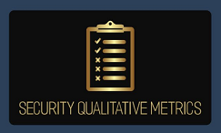

---

layout: col-sidebar
title: OWASP Security Qualitative Metrics Contributors
site_side: true
tags: security-qualitative-metrics
project: true
level: 4
type: documentation
pitch: The OWASP Security Qualitative Metrics is the most detailed list of metrics which evaluate security level of web projects. It shows the level of coverage of OWASP ASVS. 
---

# Contributing 

#  OWASP Security Qualitative Metrics 

# 
 

 

## [Dr. Ferda Özdemir Sönmez](https://www.linkedin.com/in/f-ferda-%C3%B6zdemir-s%C3%B6nmez-pmp-msc-phd-92809719/) 

## Other Supporters and Contributors
### Rebeca A. Corrales Vargas
Programa de Master en Ciberseguridad (Program for Master in Cybersecurity)
Universidad Cenfotec, San José, Costa Rica

### Paulo C. Sequeira Gutiérrez
Programa de Master en Ciberseguridad (Program for Master in Cybersecurity)
Universidad Cenfotec, San José, Costa Rica

- For user experiences and case studies please check [CASE-STUDIES-AND-EXPERIENCES.md](./CASE-STUDIES-AND-EXPERIENCES.md) 

- Ready to Contribute?
The OWASP Security Qualitative Metrics is desired to get community-driven effort and we welcome contributions and feedback.
If you would like to contribute to this project, by for example using the metrics and providing feedbacks and case-study reports or simply by offering new relevant metrics please reach out to the project leader either via email or via the officia [Gitter Chatroom](https://gitter.im/owasp-www-project-security-qualitative-metrics/community).

Found a problem? Propose a new feature? Need consultancy? 

Feel free to contact the project leader. 

