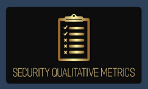
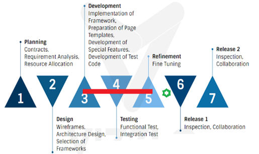
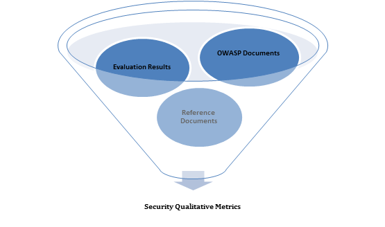

---

layout: col-sidebar
title: Methodology and Background
site_side: true
tags: security-qualitative-metrics, background, methodology
project: true
type: document
pitch: The OWASP Security Qualitative Metrics is the most detailed list of metrics which evaluate security level of web projects. It shows the level of coverage of OWASP ASVS. 
---

#  OWASP Security Qualitative Metrics

## Background and Environment Description, 

Security qualitative metrics depends on examination of relevant technical documents and literature and doing a domain analysis. In order to provide a real world perspective to the metrics a large-scale web application development project was examined in detail. Due to privacy reasons no information that may cause conjecture of the project name, and purposes will be provided. Thus, business requirements and implementation details which are not necessary to mention are out of the scope of this project. However, to describe the captured security-related decisions and their benefits for the compliance to OWASP standard an overview of the technical infrastructure of the project is provided in Figure 1.

*Fig. 1: Technical infrastructure used during domain analysis* 

This application was developed by using the integration of contemporary Java technologies forming an advanced structure which facilitate rapid application development and also provide a robust framework to develop the business requirements. On top of this framework, a code generation application which has been modified based on the project’s structure and technologies were utilized during the development. This code generation mechanism further speeded up the development project and provided fully standardized, clean code from front end to back end. Figure 1 shows a simplified infrastructure schema and names of the technologies. Featuring properties are the encapsulation of the most contemporary technologies, standard libraries, use of a layered structure, centralization of controls, utility classes and a standardized code structure. Figure 2 shows the examination period with regards to project lifecycle.

*Fig. 2: Examination period with regards to project lifecycle*

## Methodology
The security qualitative metrics list is the result of examination and evaluation of several resources. As mentioned in the background and environment description part, one of the resource was the results of examination of a large scale enterprise web application project. As a part of this investigation the code structure, including the results of automatically generated code parts, manually written code parts, centralized code parts which are related to general structure and decentralized code parts, in-house developed code parts, and third party libraries were examined. Once know-how was gathered related to project structure, and implementation details, each OWASP requirement item was examined in-depth by using inspection and questioning and answering methods with experts of the project including the senior developers, and the architects. During this analysis, the information provided by the OWASP web site was also frequently utilized. When shortcomings related to some OWASP requirements in the sample application are detected, suggestions from technical OWASP documents and other technical reference documents are made to fulfill all the OWASP set, Figure 3. While the overall results are prepared in report format, resolutions from the evaluation results and other technical suggestions are categorized and grouped into categories for reuse. 

*Fig. 3: Security Qualitative Metrics' inputs*
  
