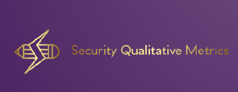

---

layout: col-sidebar
title: OWASP Security Qualitative Metrics
site_side: true
tags: security-qualitative-metrics
project: true
level: 4
type: documentation
pitch: The OWASP Security Qualitative Metrics is the most detailed list of metrics which evaluate security level of web projects. It shows the level of coverage of OWASP ASVS. 
---

#  OWASP Security Qualitative Metrics  
# 

# 

## What is "OWASP Security Qualitative Metrics Project"
The focus of this project is to find out repeatable features for large/medium-scale enterprise web application production process related to OWASP Application Security Verification Standard (OWASP ASVS) requirement list. As a result of a rigorous work including domain analysis for Java language and development frameworks and the examination of a large set of technical documents, 230 security qualitative metrics are discovered, under six categories. These security qualitative metrics are beneficial for security analysts as well as other parties such as designers, developers, and testers. The findings provide a developer/designer point of view and would help to make better decisions related to the environment set up, technology selection, architecture, design, and implementation details. As a result of using the Security Qualitative Metrics, the overall vulnerability level of the web applications would diminish significantly and user will know their level of meeting OWASP Application Security Verification Standard (OWASP ASVS).

## How to Use OWASP Security Qualitative Metrics

These classified findings would be beneficial from the initial phases of application development including analysis, design, implementation, and test. Having this categorized security qualitative metrics would allow knowing the security status and OWASP compliance results for the project, and would help to make better technology, environment, design, and implementation related decisions by various project stakeholders. Start using the metrics  [SECURITY QUALITATIVE METRICS.md](./SECURITY-QUALITATIVE-METRICS.md) 

## Learn More Background and Methodology
During the creation of metric list a lage list of technical documents along with OWASP documents are examined. In parallel to these efforts, data from a large scale enterprise software development project is used to provide domain information. More details can be found on Methodology and Background page [METHODOLOGY AND BACKGROUND.md](./METHODOLOGY-AND-BACKGROUND.md
). 

## Troubleshooting 

If you need help in understanding or using any of the project outputs please check [FAQ.md](FAQ.md) or post your specific problem
or question in the official Gitter Chat](https://gitter.im/owasp-www-project-security-qualitative-metrics/community).

Found a problem? Propose a new metric? Feel free to post your ideas in the chat](https://gitter.im/owasp-www-project-security-qualitative-metrics/community)!
Please refer to [CONTRIBUTING.md](CONTRIBUTING.md) for details.

## References

If you want to see the original publication and correponding presentation related to this project and other referencing documents/projects for this project please check the References page [REFERENCES.md](REFERENCES.md) 

## Contributors
- [Dr. Ferda Özdemir Sönmez](https://www.linkedin.com/in/f-ferda-%C3%B6zdemir-s%C3%B6nmez-pmp-msc-phd-92809719/) 

- Ready to Contribute?
The OWASP Security Qualitative Metrics is desired to get community-driven effort and we welcome contributions and feedback.
If you would like to contribute to this project, by for example using the metrics and providing feedbacks and case-study reports or simply by offering new relevant metrics please reach out to the project leader either via email or via the officia [Gitter Chatroom](https://gitter.im/owasp-www-project-security-qualitative-metrics/community).

