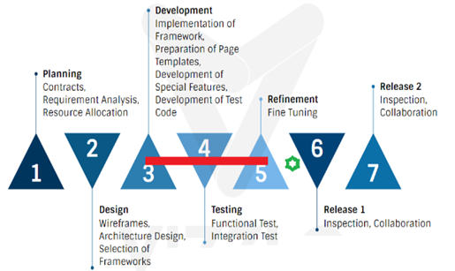
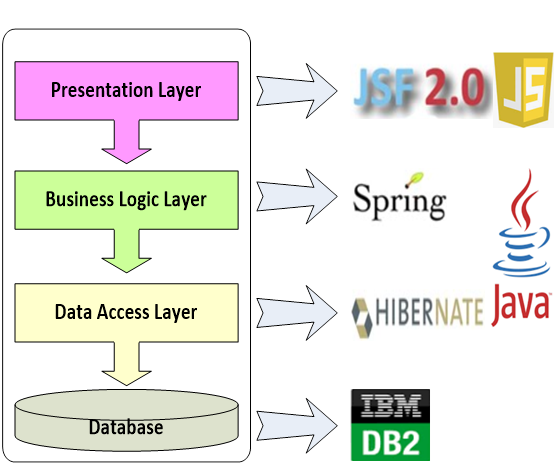
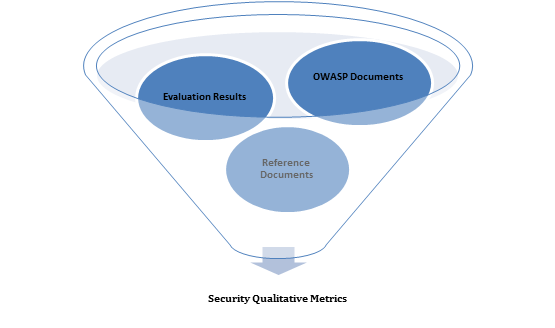

---

layout: col-sidebar
title: OWASP Security Qualitative Metrics
tags: example-tag
level: 1
type: 
pitch: A very brief, one-line description of your project

---

This is an example of a Project or Chapter Page.  Please change these items to indicate the actual information you wish to present.  In addition to this information, the 'front-matter' above this text should be modified to reflect your actual information.  An explanation of each of the front-matter items is below:

layout: This is the layout used by project and chapter pages.  You should leave this value as col-sidebar

title: This is the title of your project or chapter page, usually the name.  For example, OWASP Zed Attack Proxy or OWASP Baltimore

tags: This is a space-delimited list of tags you associate with your project or chapter.  If you are using tabs, at least one of these tags should be unique in order to be used in the tabs files (an example tab is included in this repo) 

level: For projects, this is your project level (2 - Incubator, 3 - Lab, 4 - Flagship)

type: code, tool, documentation, or other

#  OWASP GitHub Template  

## What are OWASP Security Qualitative Metrics 
The focus of this project is to find out repeatable features for large-scale enterprise web application production process related to OWASP Application Security Verification Standard (OWASP ASVS) requirement list. As a result of a rigorous work including domain analysis for Java language and development frameworks and the examination of a large set of technical documents, 230 security qualitative metrics are discovered, under six categories. These security qualitative metrics are beneficial for security analysts as well as other parties such as designers, developers, and testers. The findings provide a developer/designer point of view and would help to make better decisions related to the environment set up, technology selection, and the architecture, design, and implementation details. As a result of this effort, the overall vulnerability level of the web applications would diminish significantly.

_**TODO:** Replace screenshots above with your own._

## Background and Environment Description, 

During this work security perspective for a large-scale web application development project was examined. Due to privacy reasons no information that may cause conjecture of the project name, and purposes will be provided. Thus, business requirements and implementation details which are not necessary to mention are out of the scope of this project. However, to describe the security-related decisions and their benefits for the compliance to OWASP standard an overview of the technical infrastructure of the project is provided.

This application was developed by using the integration of contemporary Java technologies forming an advanced structure which facilitate rapid application development and also provide a robust framework to develop the business requirements. On top of this framework, a code generation application which has been modified based on the project’s structure and technologies were utilized during the development. This code generation mechanism further speeded up the development project and provided fully standardized, clean code from front end to back end. Figure 1 shows a simplified infrastructure schema and names of the technologies. Featuring properties are the encapsulation of the most contemporary technologies, standard libraries, use of a layered structure, centralization of controls, utility classes and a standardized code structure. 

## Methodology
The security qualitative metrics list is the result of examination and evaluation of several resources. As mentioned in the background and environment description part one of the resource was the results of examination of a large scale enterprise web application project. As a part of this investigation the code structure, including the results of automatically generated code parts, manually written code parts, centralized code parts which are related to general structure and decentralized code parts, in-house developed code parts, and third party libraries were examined. Once know-how was gathered related to project structure, and implementation details, each OWASP requirement item was examined in-depth by using inspection and questioning and answering methods with experts of the project including the senior developers, and the architects. During this analysis, the information provided by the OWASP web site was also frequently utilized. When shortcomings related to some OWASP requirements in the sample application are detected, suggestions from technical OWASP documents and other technical reference documents are made to fulfill all the OWASP set, Figure 3. While the overall results are prepared in report format, resolutions from the evaluation results and other technical suggestions are categorized and grouped into categories for reuse. 

## How to Use OWASP Security Qualitative Metrics

These classified findings would be beneficial from the initial phases of application development including analysis, design, implementation, and test. Having this categorized security qualitative metrics would allow knowing the security status and OWASP compliance results for the project, and would help to make better technology, environment, design, and implementation related decisions by various project stakeholders.

## Troubleshooting 

If you need help with the setup please check the
[TROUBLESHOOTING.md](TROUBLESHOOTING.md) or post your specific problem
or question in the
[official Gitter Chat](https://gitter.im/owasp/github-template).

## Contributing  

Found a bug? Crashed the tool? Propose a new feature?

Feel free to
[create an issue](https://github.com/owasp/github-template/issues) or
[post your ideas in the chat](https://gitter.im/owasp/github-template)!
Pull requests are also highly welcome - please refer to
[CONTRIBUTING.md](CONTRIBUTING.md) for details.

## References

If you want to see the original publication and correponding presentation related to this project and other referencing documents/projects for this project please check the References page [REFERENCES.md](REFERENCES.md) 

## Donations

### PayPal 

PayPal donations via above button go to the OWASP Foundations and are
earmarked for "OWASP Security Qualitative Metrics". This is the preferred way to support
the project.

_**TODO:** Add alternative ways to donate to the project financially
here, e.g. BitCoin address or other micropayment provider links._

## Credits

_**TODO:** Add "special thanks to..."-like credits here. Please **do not
add sponsors** here! These belong into the
["Acknowledgements" tab of your OWASP Project wiki page](https://www.owasp.org/index.php/OWASP_Juice_Shop_Project#tab=Acknowledgements)
exclusively!_

## Contributors

_**TODO:** You can generate a list of contributors via various open
source tools, e.g. `node-authors`_

Ordered by date of first contribution.
[Auto-generated](https://github.com/dtrejo/node-authors) on Tue, 06 Jun
2017 00:00:00 GMT.

- [Björn Kimminich](https://github.com/bkimminich) aka `bkimminich`

## Licensing  

This program is free software: you can redistribute it and/or modify it
under the terms of the [MIT license](LICENSE). OWASP GitHub Template and
any contributions are Copyright © by Bjoern Kimminich 2017.

_**TODO:** Replace above text and the contents of the
[LICENSE file](LICENSE) with
[chosen open-source license](https://opensource.org/licenses)._

_**TODO:** Replace with your own full-size logo._

_**TODO:** Replace all occurences of `GitHub Template` and
`owasp/github-template` with your own project name and repository path._
